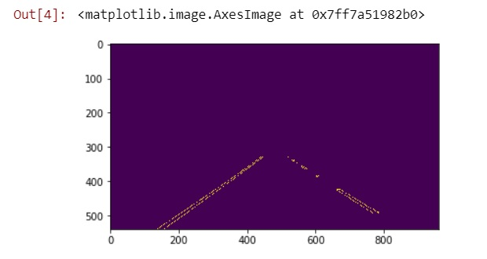
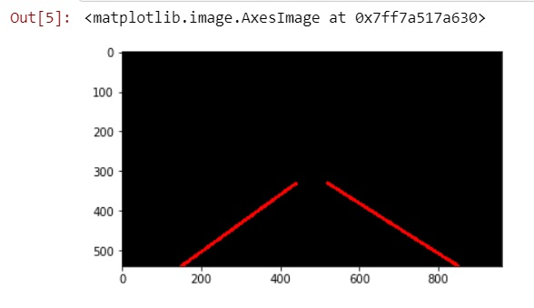
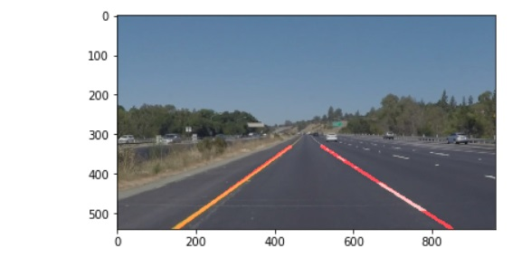
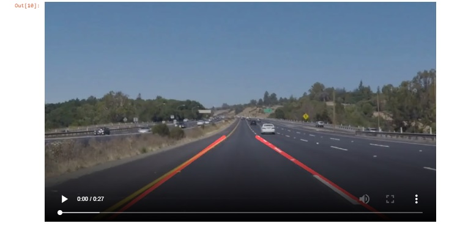

# **Finding Lane Lines on the Road** 

## Summary

The objective of the Project is to detect lane lines in the test_images using OPEN_CV and python and later deploy the same technique to detect lanes in the video

---

## Finding Lane Lines on the Road

The goals / steps of this project are the following:
* Make a pipeline that finds lane lines on the road
* Reflecting the work in a markdown file

---

## Reflection

### 1. Detection of Lane lines
My pipeline has the following steps:

#### Step: 1 Canny Edge Detection
First image is converted to Grayscale to remove the color information and then Gaussian blur is applied
over the image to smoothen the image. Canny Edge detection openCV function is applied over the
image to detect the possible Edges or lane lines in the image.
For the Canny Edge detection following are the parameters assumed
* kernel_size = 5
* low_threshold = 50
* high_threshold = 150.
To avoid data interfering with our lane detection from other areas of the image, a polygon is applied
over the image to remove data in the unwanted region and select data in the region of our interest. The
Polygon data points applied over the image are
(0,imshape[0]),(360, 325), (510, 325), (imshape[1],imshape[0])
where imshape[0] is length of the image in Y -axis
where imshape[1] is length of the image in X –axis

#### Step: 2 Hough transformation

Next step is to find the hough_lines in the image. For this OpenCV function HoughLinesP is used and the
parameters configured for the Hough transformation are
 rho = 1
 theta = np.pi/180
 threshold = 20
4.min_line_len = 40
 max_line_gap = 20
The hough_lines detected are discontinuous lines and as per the Project expectations we have to
extrapolate them as a single solid line representing the lane. This is done in the extrapolation method
draw_lines which is described in step3.

#### Step: 3 Extrapolation of lines using draw_line method

The output of HoughLinesP is series of line data points. Slope is calculated for these lines to segregate
them in to left and Right lane. As lines are parallel in real world, this will make them converging line in
the image with positive and negative slope.
So the next job is to segregate the positive slope and negative slope aka Right lane and left lane. Then
the segregated positive and negative slope lines are passed as an argument to the openCV function
fitline as (X1,Y1) and (X2,y2) points instead of line to find out the slope of Right and left lane.
Once the slope of the line is found this can be extrapolated over the image with the lane starting point
Y1 at the Ymax (length of Image Y axis) and the another point near the top of the region of interest
(polygon we considered)

Finally this line is drawn over the image to produce the expected output.

#### Step: 4 Detection of lane lines in the Video
Next step is to extend this logic over the video and find the lanes lines with the use of helper function
provided in the P1 project

### 2. Potential shortcomings with current pipeline

One potential shortcoming would be when the car is moving in a curved path the algorithm won’t work
and can’t detect the lane lines.

Another shortcoming could be when the car is changing the lane the extrapolation logic I have written will mess up multiple lanes and give a lane line that connects them both.

### 3. Possible improvements to pipeline

A possible improvement would be instead of find straight lines we should apply regression, connect relevant points based on lane and find curves and connect them. This will solve the problem when the lane lines are curved.
